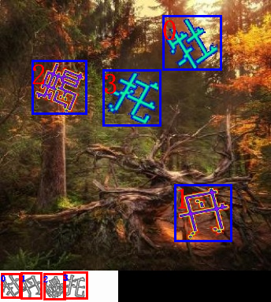
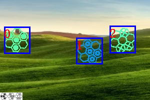
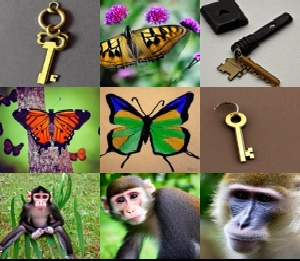
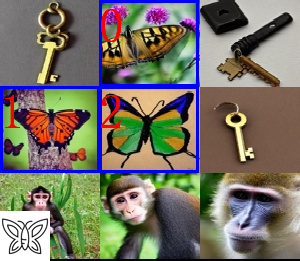

## 验证码识别

- [x] 文字点选

- [x] 图标点选

- [x] 九宫格(四代 and 三代)

PS: 对于文字点选, 感觉可以当做一个简单的针对性的 OCR 识别, 因为文字分类有 1500+ 个.

## 免责声明

本项目旨在研究深度学习在验证码攻防上的应用。仅供学习交流使用，请勿用于非法用途，不得在任何商业使用，本人不承担任何法律责任。

## 运行环境

```bash
conda create -n yzm python=3.10 -y
conda activate yzm
pip install -r requirements.txt
```

- 理论上支持 3.10 及以上的版本, 但是没有测试过, 请自行测试. 3.10 以下的版本, 也自行测试

## 使用方法

```bash
## 文字点选 ---- 本地直接调用模型来识别(输出在 example/temp1/output.png 文件夹下)
python demo_geetest3word.py

## 图标点选 ---- 本地直接调用模型来识别(输出在 example/temp2/output.png 文件夹下)
python demo_geetest4icon4mi.py

## 九宫格 ---- 本地直接调用模型来识别(结果在 example/temp3/output.png )
python demo_geetest3nine.py
```

- 当然也可以传入自己的模型, 按照案例中的格式传入即可

## 用空请作者喝杯咖啡吗?

如果这个项目对您有帮助, 就请作者喝杯咖啡吧, 您的支持是作者最大的动力. 给个 star 也是对作者的支持.

| Wechat Pay                                | Ali Pay                                   |
| ----------------------------------------- | ----------------------------------------- |
|  |  |

## 模型下载

- 下载下来以后, 把模型放到项目的指定位置即可, 一般放到 model 目录下(直接替换即可)

- [huggingface:](https://huggingface.co/zscmmm/yzm7)

## 简单的案例展示

- 文字点选

```bash
python demo_geetest3word.py
```

| 原图                                                          | 效果                                                 |
| ------------------------------------------------------------- | ---------------------------------------------------- |
|  |  |

- 图标点选.

需要传入额外的小图标且注意传入顺序, 即验证码右上角的小图标. 如果是透明的,需要把移除透明度设置为 `True`

```bash
python demo_geetest4icon4mi.py
```

| 原图                                                           | 效果                                                 |
| -------------------------------------------------------------- | ---------------------------------------------------- |
|  |  |

- 九宫格

同理,也需要传入额外的小图标. 即验证码右上角的小图标

```bash
python demo_geetest3nine.py
```

| 原图                                                          | 效果                                                 |
| ------------------------------------------------------------- | ---------------------------------------------------- |
|  |  |

## app 服务

- 采用 fastapi 框架, 一个简单的验证码识别服务.

```bash
python service.py   # 启动服务, 地址: 127.0.0.1:9100

```

测试的输入结果

```
{'code': 200, 'msg': 'success', 'data': {'imageID': 'string', 'res': [[206.15, 19.79, 281.41, 89.9], [221.8, 234.02, 294.53, 307.69], [40.36, 76.1, 110.0, 145.15], [130.65, 88.2, 204.8, 160.11]]}}
{'code': 200, 'msg': 'success', 'data': {'imageID': 'string', 'res': [[99, 0, 198, 86], [0, 86, 99, 172], [99, 86, 198, 172]]}}
{'code': 200, 'msg': 'success', 'data': {'imageID': 'string', 'res': [[8.05, 53.09, 60.95, 107.45], [152.49, 75.74, 205.45, 128.27], [219.18, 51.93, 271.23, 106.0]]}}
```

## 增加 js 验证功能

- 仅测试是否通过验证, 这东西具有时效性,不一定还能用

```bash
# npm install     # 安装依赖
# python service.py    #建议先启动服务, 然后再启动 js 代码

python jsdemo_g3word_1.py   #文字点选的一种方式
python jsdemo_g3word_2.py   #文字点选的另一种方式 (需要启动接口服务) --推荐
python jsdemo_g4icon.py
python jsdemo_nine3.py

```

具体的 api,可以参考: http://localhost:9100/docs

## 模型训练流程

模型不具有泛化性，需要根据具体的验证码进行训练，可以参考案例中的模型训练方法, 其实训练比较简单, 关键是标注数据, 以及数据的预处理

- 文字点选大概用了 6300+ 张

- 图标点选大概用了 800+ 张

- 九宫格大概用了 800+ 张 (不记得了, 太久了)

模型的主要训练过程

1. 标注数据, 先用几百张数据, 进行标注
2. 数据预处理
3. 模型训练, yolov8 目标检测和分类模型, siamese 网络
4. 模型测试, 在一个更大的数据集上测试, 然后看模型的效果, 把预测不好的数据人工标注, 重新训练
5. 重复 1--4 步骤, 直到模型效果满意(好像有 3.2w+ 张不重复的数据, 预测效果不错, 感觉有 99.99%的样子, 具体没有统计过了. )

后面的图标和九宫格就只训练了几百张数据, 如果有需要可以继续, 接口已写好,可以生成 lableme 格式的数据, 然后来回倒腾训练即可.

- 比如, 利用 yolo 模型进行分类和孪生网络进行分类, 查看二者分的一不一致, 以及 yolo 分类会不会错误分类, 如果存在上述的情况,把错误的图片单独复制出来,以及对应的 lableme 格式的标注文件也复制出来, 然后就是手动标注了.

- 对于 九宫格和图标点选, 原理一样,直接根据模型进行分类裁剪,然后人工查看.

- 对应 YOLO 模型,采用的是 pt 文件, 当然只要你愿意,可以采用 onnx 文件

```python
# 一个简单实用 onnxruntime 的例子来运行 YOLOv8 生成的 onnx 模型
# pip install onnx-predict-yolov8  或者找其他库, 也可以,这里做一个简单的演示

from src.utils.utils import open_image
import onnxruntime as ort
from opyv8 import Predictor

i = "assets/word3/pic_00356_20119.png"
model = "model/g3word6300/detect.onnx"
session = ort.InferenceSession(model, providers=[ "CPUExecutionProvider"])
predictor = Predictor(session, ["char", "target"])
img  = open_image(i)
print(predictor.predict(img))
```

## 起因

- 本项目的目的是为了学习, 请勿用于非法用途, 本人不承担任何法律责任.

- 作为深度学习的入门者, 一直想找一个比较有挑战性的项目, 看见网上都没有彻底开源此类模型, 本着开源的精神, 把自己的一些心得体会分享出来, 也希望大家能够一起交流, 一起进步.

- 深度学习感觉需要掌握的只是太多, 只能从案例直接入手, 一开始的时候, 也是一头雾水, 从数据的标注, 数据的预处理, 模型的训练, 模型的测试, 一步一步的走下来, 也是一种成长, 也是一种收获.

- 关键点在于: 最近终于有资金购买显卡了(还是一个 4060), 才入坑深度学习, 之前一直有心无力, 也是一种机缘吧. 苦逼的我!!!

- 本人代码水平有限,可能存在很多 bug,

## 参考

- [https://github.com/ultralytics/ultralytics](https://github.com/ultralytics/ultralytics)

- [https://github.com/bubbliiiing/Siamese-pytorch](https://github.com/bubbliiiing/Siamese-pytorch)

- [https://github.com/MgArcher/Text_select_captcha](https://github.com/MgArcher/Text_select_captcha)

- [https://github.com/sijiyo/projects](https://github.com/sijiyo/projects)

## Star History

[](https://star-history.com/#caisxg/dianxuan&Date)
